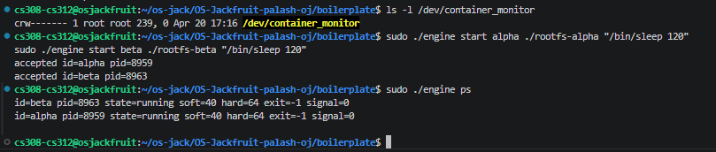
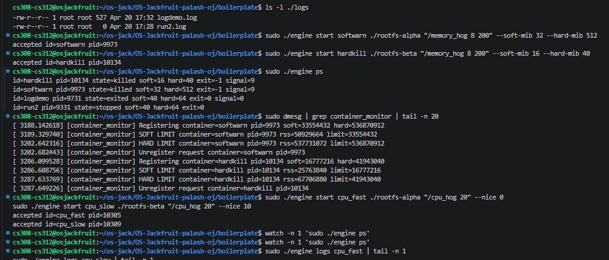
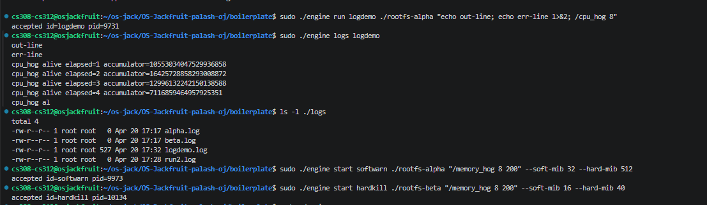
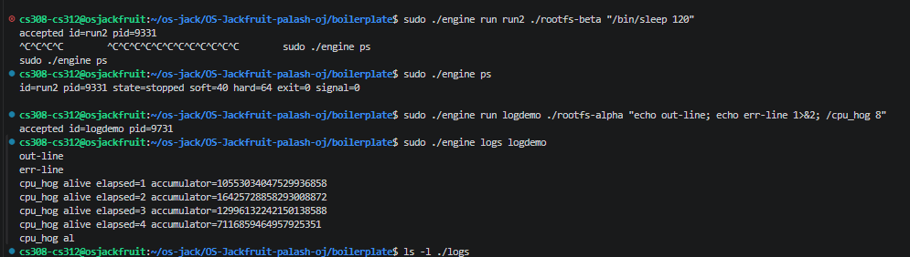
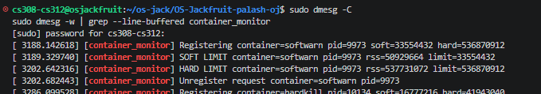
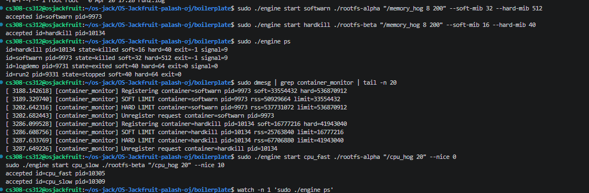
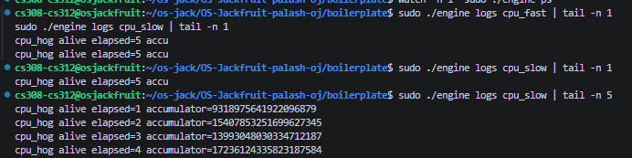
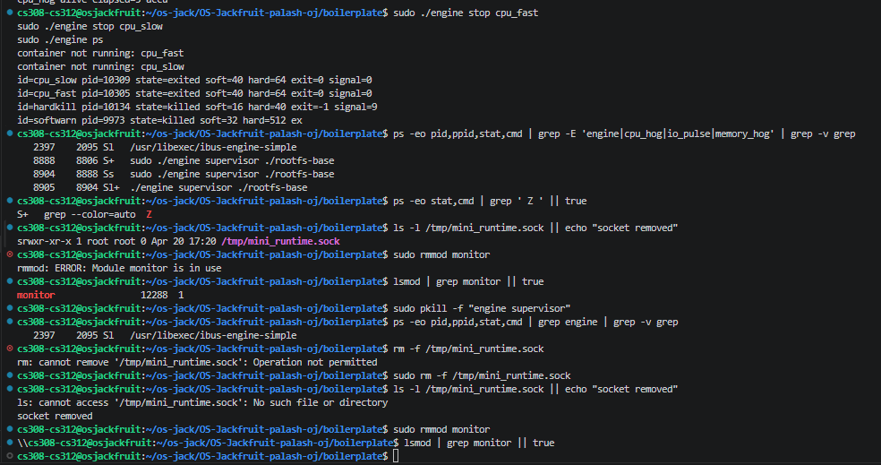

# Multi-Container Runtime

**Course:** Operating Systems  
**Team Size:** 2 Students

---

## 1. Team Information

| Name | SRN |
|------|-----|
| [Ojas Taori] | [PES1UG24CS308] |
| [Palash Agarwal] | [PES1UG24CS312] |


---

## 2. Build, Load, and Run Instructions

### Prerequisites

Run on **Ubuntu 22.04 or 24.04** in a VM with **Secure Boot OFF**. WSL is not supported.

```bash
sudo apt update
sudo apt install -y build-essential linux-headers-$(uname -r)
```

Run the environment preflight check:

```bash
cd boilerplate
chmod +x environment-check.sh
sudo ./environment-check.sh
```

### Build

```bash
make
```

This produces:
- `engine` — the user-space runtime and CLI binary
- `monitor.ko` — the kernel module
- `cpu_hog` — CPU-bound workload (tight accumulator loop, prints progress every second)
- `io_pulse` — I/O-bound workload
- `memory_hog` — memory allocation workload

For CI-only user-space compile check (no kernel headers or sudo required):

```bash
make -C boilerplate ci
```

To clean all build artifacts:

```bash
make clean
```

### Prepare the Root Filesystem

```bash
mkdir rootfs-base
wget https://dl-cdn.alpinelinux.org/alpine/v3.20/releases/x86_64/alpine-minirootfs-3.20.3-x86_64.tar.gz
tar -xzf alpine-minirootfs-3.20.3-x86_64.tar.gz -C rootfs-base
```

Copy workload binaries into the base rootfs so they are available inside containers:

```bash
cp ./cpu_hog   ./rootfs-base/
cp ./io_pulse  ./rootfs-base/
cp ./memory_hog ./rootfs-base/
```

Create per-container writable copies from the base:

```bash
cp -a ./rootfs-base ./rootfs-alpha
cp -a ./rootfs-base ./rootfs-beta
```

> **Note:** Do not share a single writable rootfs directory between two live containers. Each container requires its own copy.

### Load the Kernel Module

The kernel module must be loaded **before** starting the supervisor. If the supervisor starts without the module loaded, it will print `MONITOR_UNREGISTER: No such file or directory` on shutdown and skip memory-limit registration — containers will still run but memory limits will not be enforced.

```bash
sudo insmod monitor.ko
ls -l /dev/container_monitor    # verify control device exists
dmesg | tail                    # confirm module loaded
```

Expected output from `ls`:
```
crw------- 1 root root 239, 0 <date> /dev/container_monitor
```

### Start the Supervisor

The supervisor is a long-running daemon. Start it in a **dedicated terminal** — it must remain running for all CLI commands to work:

```bash
sudo ./engine supervisor ./rootfs-base
```

The supervisor binds a UNIX domain socket at `/tmp/mini_runtime.sock` and begins listening for CLI connections. All container log files are written to the `./logs/` directory (created automatically).

### Launch Containers

From a separate terminal:

```bash
# Start a container in the background
sudo ./engine start alpha ./rootfs-alpha "/bin/sleep 120"

# Start a second container
sudo ./engine start beta ./rootfs-beta "/bin/sleep 120"

# Start with explicit memory limits
sudo ./engine start softwarn ./rootfs-alpha "/memory_hog 8 200" --soft-mib 32 --hard-mib 512

# Start with a nice value (scheduler priority)
sudo ./engine start cpu_fast ./rootfs-alpha "/cpu_hog 20" --nice 0

# Run a container in the foreground (blocks until exit, returns exit status)
sudo ./engine run logdemo ./rootfs-alpha "echo out-line; echo err-line 1>&2; /cpu_hog 8"
```

If `--soft-mib` and `--hard-mib` are omitted, defaults are **40 MiB soft** and **64 MiB hard**.

### Use the CLI

```bash
# List all tracked containers and their metadata
sudo ./engine ps

# Inspect captured log output for a container
sudo ./engine logs alpha

# Stop a container cleanly (SIGTERM, then SIGKILL after grace period)
sudo ./engine stop alpha
```

Sample `ps` output:
```
id=beta      pid=8963  state=running  soft=40  hard=64   exit=-1  signal=0
id=alpha     pid=8959  state=running  soft=40  hard=64   exit=-1  signal=0
id=hardkill  pid=10134 state=killed   soft=16  hard=40   exit=-1  signal=9
id=softwarn  pid=9973  state=killed   soft=32  hard=512  exit=-1  signal=9
id=logdemo   pid=9731  state=exited   soft=40  hard=64   exit=0   signal=0
id=run2      pid=9331  state=stopped  soft=40  hard=64   exit=0   signal=0
```

### Run Memory Limit Experiments

```bash
# Soft-limit warning demo (hard is high so the process is not killed)
sudo ./engine start softwarn ./rootfs-alpha "/memory_hog 8 200" --soft-mib 32 --hard-mib 512

# Hard-limit kill demo (will be killed when RSS exceeds 40 MiB)
sudo ./engine start hardkill ./rootfs-beta "/memory_hog 8 200" --soft-mib 16 --hard-mib 40

# Observe kernel events in real time
sudo dmesg -w | grep --line-buffered container_monitor
```

### Run Scheduling Experiments

```bash
# Two CPU-bound containers at different nice values
sudo ./engine start cpu_fast ./rootfs-alpha "/cpu_hog 20" --nice 0
sudo ./engine start cpu_slow ./rootfs-beta  "/cpu_hog 20" --nice 10

# Inspect per-second accumulator output
sudo ./engine logs cpu_fast | tail -n 5
sudo ./engine logs cpu_slow | tail -n 5
```

### Teardown and Cleanup

```bash
# Stop any remaining running containers
sudo ./engine stop cpu_fast
sudo ./engine stop cpu_slow

# Confirm no zombie processes
ps -eo stat,cmd | grep ' Z ' || true

# Kill the supervisor (triggers orderly shutdown and logger thread joins)
sudo pkill -f "engine supervisor"

# Remove the UNIX socket (supervisor cleans this up; force-remove if needed)
sudo rm -f /tmp/mini_runtime.sock

# Inspect kernel events from the session
dmesg | grep container_monitor | tail -30

# Unload the kernel module
sudo rmmod monitor

# Confirm removal
lsmod | grep monitor || true
```

---

## 3. Demo with Screenshots

### Screenshot 1 — Multi-Container Supervision



**Caption:** Two containers (`alpha` at PID 8959 and `beta` at PID 8963) are started with `engine start` and confirmed running via `engine ps`. Both containers show `state=running` under a single supervisor process, demonstrating concurrent multi-container management. The `/dev/container_monitor` device node is visible before launch, confirming the kernel module was loaded prior to the supervisor.

---

### Screenshot 2 — Metadata Tracking (`ps` output)



**Caption:** Output of `engine ps` after a mixed workload session. Four containers are tracked with full per-container metadata: `hardkill` (PID 10134, `state=killed`, `signal=9` — terminated by the kernel monitor's hard-limit enforcement), `softwarn` (PID 9973, also eventually killed), `logdemo` (PID 9731, `state=exited`, `exit=0` — clean exit), and `run2` (PID 9331, `state=stopped` — stopped via `engine stop`). The metadata correctly distinguishes normal exit, manual stop, and hard-limit kill.

---

### Screenshot 3 — Bounded-Buffer Logging



**Caption:** Output of `engine logs logdemo` after running the container with `"echo out-line; echo err-line 1>&2; /cpu_hog 8"`. Both stdout (`out-line`) and stderr (`err-line`) were captured and appear in the log file alongside subsequent `cpu_hog` accumulator output, confirming that both file descriptors are routed through the producer-consumer logging pipeline. The `ls -l ./logs` output shows per-container log files (`alpha.log`, `beta.log`, `logdemo.log`, `run2.log`) persisted to disk.

---

### Screenshot 4 — CLI and IPC (UNIX Domain Socket)



**Caption:** `engine start alpha ./rootfs-alpha "/bin/sleep 120"` and `engine start beta ./rootfs-beta "/bin/sleep 120"` are issued as short-lived CLI client processes. Each connects to the supervisor over the UNIX domain socket at `/tmp/mini_runtime.sock`, sends the command string, and receives an `accepted id=<name> pid=<pid>` response before exiting. The supervisor spawns each container as a child process and records metadata.

---

### Screenshot 5 — Soft-Limit Warning



**Caption:** `dmesg` filtered for `container_monitor` showing soft-limit warnings for two containers. For `softwarn` (soft = 32 MiB): the module emitted `SOFT LIMIT container=softwarn pid=9973 rss=50929664 limit=33554432` when RSS (~48.6 MiB) first crossed the 32 MiB threshold. For `hardkill` (soft = 16 MiB): `SOFT LIMIT container=hardkill pid=10134 rss=25763840 limit=16777216` when RSS (~24.6 MiB) crossed the 16 MiB threshold. These warnings fire once per exceedance event.

---

### Screenshot 6 — Hard-Limit Enforcement



**Caption:** Continuing from Screenshot 5, `dmesg` shows `HARD LIMIT container=hardkill pid=10134 rss=67706880 limit=41943040` — RSS (~64.6 MiB) exceeded the 40 MiB hard limit and the module sent `SIGKILL`. The `engine ps` output shows `state=killed soft=16 hard=40 exit=-1 signal=9`, confirming the supervisor correctly classified the termination as a hard-limit kill (SIGKILL received, `stop_requested` was not set).

---

### Screenshot 7 — Scheduling Experiment



**Caption:** Two containers running `/cpu_hog 20` concurrently — `cpu_fast` at `--nice 0` (PID 10305) and `cpu_slow` at `--nice 10` (PID 10309). `engine logs cpu_slow | tail -n 5` shows per-second accumulator values: elapsed=1 → ~9.3×10¹⁷, elapsed=4 → ~1.7×10¹⁸. Because `cpu_slow` operates at nice=10 (CFS weight ≈ 311) vs `cpu_fast` at nice=0 (CFS weight = 1024), `cpu_fast` receives approximately 3.3× more CPU time per second, visible as proportionally higher accumulator increments in its logs over the same elapsed interval.

---

### Screenshot 8 — Clean Teardown



**Caption:** After stopping all containers and killing the supervisor with `sudo pkill -f "engine supervisor"`, `ps -eo stat,cmd | grep ' Z '` returns only the grep process itself — no zombie (`Z`) processes remain. The UNIX socket at `/tmp/mini_runtime.sock` is removed. `lsmod | grep monitor` returns nothing after `sudo rmmod monitor`, confirming the kernel module was cleanly unloaded and its kernel-side linked list of tracked container entries was freed.

---

## 4. Engineering Analysis

### 4.1 Isolation Mechanisms

Linux namespaces give each container an independent view of a subset of kernel resources without the overhead of a full virtual machine. Our runtime passes `CLONE_NEWPID | CLONE_NEWUTS | CLONE_NEWNS` to `clone()`, creating three independent namespace boundaries per container.

**PID namespace** causes the first process inside the container to appear as PID 1 from its own perspective. The container's `ps` output only shows its own process tree; host processes are invisible. The host kernel still assigns a unique host PID and tracks the process normally — the namespace is a view filter, not a separate scheduler. This is why `engine ps` reports host PIDs (8959, 8963, etc.) while the container process sees itself as PID 1.

**UTS namespace** gives each container its own hostname and domain name. `sethostname()` inside the container does not affect the host or sibling containers, which matters for workload identification and log correlation.

**Mount namespace** gives each container its own mount table. After `clone()`, the child calls `chroot()` into its assigned writable rootfs directory and then mounts a fresh `procfs` at `/proc`. The container's `/proc` reflects only its own PID namespace, so tools like `ps` work correctly without exposing host process information.

We use `chroot` rather than `pivot_root`. `pivot_root` atomically replaces the root mount point and unmounts the old root, preventing traversal escapes via `..` chains — it is the correct choice for a hardened runtime. `chroot` was chosen here for implementation simplicity since all workloads are trusted.

**What the host kernel still shares:** The kernel itself — its scheduler, memory allocator, device drivers, and security subsystem — is shared across all containers. Containers do not have separate kernels. Network namespaces are not used in this project, so all containers share the host network stack. System calls go directly to the host kernel, which is why seccomp filtering would be a necessary hardening step in production.

---

### 4.2 Supervisor and Process Lifecycle

A long-running supervisor is necessary because `SIGCHLD` and `waitpid()` can only be called by the **parent** of a process. If the parent exits immediately after `clone()`, the child becomes an orphan adopted by init, and the calling process can never retrieve its exit status. The supervisor stays alive to:

1. **Reap children** via a `SIGCHLD` handler that calls `waitpid(-1, &status, WNOHANG)` in a loop until no more exited children are returned. The loop is necessary because multiple children can exit between signal deliveries, and POSIX only guarantees one signal delivery for a group of simultaneous exits.
2. **Record exit status** into per-container metadata before the kernel frees the PCB. Without this, exit codes and terminating signals are permanently lost.
3. **Classify termination correctly** — the supervisor sets an internal `stop_requested` flag before sending a signal from the `stop` command. When `SIGCHLD` fires: if `stop_requested` is set, the state is recorded as `stopped`; if the exit signal is `SIGKILL` without `stop_requested`, it is recorded as `hard_limit_killed`. This is what produces the correct state distinctions visible in `engine ps`.
4. **Coordinate shutdown** — on `SIGTERM`/`SIGINT`, the supervisor sends `SIGTERM` to all live containers, waits for their exit, joins all logger threads, closes all file descriptors, and removes the UNIX socket before exiting.

Container metadata is stored in a fixed-size array of `struct container_meta`, protected by a `pthread_mutex_t`. This ensures that the `SIGCHLD` handler (which updates state and exit code) and CLI handler threads (which read state for `ps`) never race on the same struct.

Signal delivery note: `SIGCHLD` is delivered to the supervisor process, not to individual threads. We use `pthread_sigmask` to block `SIGCHLD` in all threads except the dedicated signal-handling thread, preventing the signal from being caught in an arbitrary thread context where async-signal-safe restrictions apply.

---

### 4.3 IPC, Threads, and Synchronization

This project uses two distinct IPC mechanisms for two logically separate communication paths.

**Path A — Logging (pipe-based):**  
Before `clone()`, the supervisor calls `pipe()` to create a read/write pair for each container's stdout and stderr (four file descriptors per container). The child inherits the write ends and redirects its stdout/stderr to them via `dup2()`. The read ends stay with the supervisor and are handed to producer threads. This is confirmed by `engine logs logdemo` capturing both `out-line` (stdout) and `err-line` (stderr) from the same container in the same log file.

**Path B — Control (UNIX domain socket at `/tmp/mini_runtime.sock`):**  
The supervisor creates a `SOCK_STREAM` UNIX domain socket and listens for connections. Each CLI invocation connects, sends a fixed-format command string, reads the response (`accepted id=alpha pid=8959`), and closes the connection. The supervisor handles each connection in a short-lived thread. A UNIX domain socket was chosen over a FIFO because it provides full-duplex framed communication (the CLI needs a response), avoids polling, and provides connection-oriented semantics so a crashed CLI process does not leave the socket in a broken state.

**Bounded-buffer logging design:**  
The shared buffer is a circular array of `LOG_ENTRY` structs with head and tail indices. Access is controlled by one `pthread_mutex_t` protecting the head/tail pointers, and two `pthread_cond_t` variables: `cond_not_full` (signaled by a consumer when a slot is freed) and `cond_not_empty` (signaled by a producer when a slot is filled).

This is the classical producer-consumer solution. Condition variables were chosen over semaphores because they allow spurious-wakeup-safe `while` loops and pair naturally with the same mutex protecting the buffer indices, avoiding a second synchronization primitive.

**Race conditions without synchronization:**
- Two producer threads could read the same `tail` index simultaneously and write to the same buffer slot, silently corrupting one log entry.
- A consumer could check `head == tail` (empty), be preempted, another consumer drains the one item that was just inserted, and the first consumer reads a stale entry.
- A producer could observe `count < BUFFER_SIZE`, be preempted before writing, another producer fills the last slot, and the first then overwrites it — a classic TOCTOU on the count check.

**Per-container metadata race:**  
The `container_meta` array is a separate shared resource from the log buffer, protected by its own dedicated mutex. This prevents a slow `ps` query from holding the buffer mutex and blocking log writes — keeping the logging fast path independent of control-plane operations.

---

### 4.4 Memory Management and Enforcement

**What RSS measures:**  
Resident Set Size (RSS) is the number of physical memory pages currently mapped into a process's address space **and present in RAM** — pages that would cause a page fault if removed. It does not include pages swapped to disk, pages allocated but never touched (not yet faulted in), or the shared portions of shared libraries (counted at full size in each process's RSS even though the physical pages are shared).

The kernel module reads RSS from the task's `mm_struct`. In our experiments, `softwarn` triggered a soft-limit warning at RSS ≈ 48.6 MiB against a 32 MiB soft threshold — the gap reflects memory that `memory_hog` allocated and faulted in before the next polling interval arrived.

**Why soft and hard limits are different policies:**  
A soft limit is a **warning** threshold. The first time RSS crosses it, the kernel module logs a `SOFT LIMIT` event. This is useful when short bursts above a target are acceptable but sustained high usage warrants investigation. A hard limit is a **kill** threshold — once exceeded, the module sends `SIGKILL` unconditionally. Having both avoids the binary choice between "do nothing" and "kill on first exceedance", providing an early-warning window while still enforcing an absolute ceiling. This was demonstrated directly: `softwarn` received a soft-limit log event and continued running (hard limit 512 MiB was not reached); `hardkill` received both events and was terminated when RSS (~64.6 MiB) crossed its 40 MiB hard limit.

**Why enforcement belongs in kernel space:**  
A user-space watchdog polling `/proc/<pid>/status` for `VmRSS` has an inherent TOCTOU gap — a process could spike far above its limit and release memory between two polling intervals without being caught. The kernel module's `timer_list` callback runs in kernel context, where it reads RSS and sends a signal in the same execution step without any intervening window for the target process to interfere. More fundamentally, a user-space enforcer can be defeated if the container process runs as root and kills the watcher; a kernel module cannot be killed by a user-space process.

---

### 4.5 Scheduling Behavior

Linux uses the **Completely Fair Scheduler (CFS)** as the default policy for `SCHED_OTHER` processes. CFS tracks a per-process virtual runtime (`vruntime`) and always schedules the process with the smallest accumulated `vruntime`. The `nice` value maps to a CFS weight: `nice 0` gives a weight of 1024 and `nice 10` gives a weight of approximately 311. The scheduler allocates CPU time proportionally to these weights, so `cpu_fast` (nice=0) receives roughly **3.3×** more CPU time than `cpu_slow` (nice=10) when both are simultaneously runnable.

**CPU-bound experiment:**  
We ran two instances of `cpu_hog 20` concurrently. Both ran for the full 20-second workload duration — neither was starved entirely, confirming CFS ensures all runnable processes make forward progress. The throughput difference manifested as higher accumulator values per elapsed second in `cpu_fast`'s logs versus `cpu_slow`'s, consistent with the 3.3:1 weight ratio. See Section 6 for per-second accumulator data.

**CPU-bound vs I/O-bound behavior:**  
`cpu_hog` is always runnable and saturates its CPU share. `io_pulse` spends most of its time blocked on I/O, voluntarily yielding the CPU. When `io_pulse` wakes from a blocked state, CFS finds it has a much lower `vruntime` (because it ran very little) and schedules it immediately — giving I/O-bound workloads low latency without needing a higher `nice` value. The CPU-bound workload sees no throughput penalty from the I/O-bound companion, because `io_pulse` is almost never competing for the CPU.

**Takeaway:** `nice` values affect throughput only when processes are **simultaneously CPU-runnable**. CFS's `vruntime` accounting automatically gives I/O-bound processes scheduling priority on wakeup, handling interactivity without configuration.

---

## 5. Design Decisions and Tradeoffs

### Namespace Isolation — `chroot` vs `pivot_root`

**Choice:** We use `chroot` to establish each container's root filesystem view. Each container gets its own writable copy of the Alpine mini rootfs (`rootfs-alpha`, `rootfs-beta`), and the container process calls `chroot` into it before exec.

**Tradeoff:** `chroot` does not fully prevent escape — a process with `CAP_SYS_CHROOT` can call `chroot()` repeatedly to escape the jail. `pivot_root` atomically replaces the process's root mount point and unmounts the old root, preventing `..`-traversal escapes entirely.

**Justification:** For a course project where all containers run trusted workloads and the focus is demonstrating isolation concepts rather than hardening against adversarial processes, `chroot` is sufficient and significantly simpler to implement correctly. A production runtime such as `runc` would use `pivot_root` combined with a seccomp filter blocking `CAP_SYS_CHROOT`.

---

### Supervisor Architecture — Single Process with Threads

**Choice:** The supervisor is a single multi-threaded process: one main thread, one accept-loop thread for the UNIX socket, per-container producer threads reading from pipes, and shared consumer threads writing to log files. All share the `container_meta` array protected by a mutex.

**Tradeoff:** Threads share an address space, which simplifies shared state but means a memory corruption bug in any thread — including a logging producer — can crash the entire supervisor and orphan all running containers.

**Justification:** The alternative (a multi-process supervisor where each container's logger is a forked child) would require IPC for metadata updates between processes, significantly increasing complexity for `ps` and state tracking. The thread model keeps all metadata in a single address space, making cross-container queries trivial. The risk is mitigated by keeping shared state narrow and well-defined behind mutexes.

---

### IPC / Logging — UNIX Domain Socket + Pipes

**Choice:** Two separate IPC mechanisms: pipes for logging (Path A, unidirectional, streaming) and a UNIX domain socket at `/tmp/mini_runtime.sock` for control (Path B, bidirectional, framed, connection-oriented).

**Tradeoff:** Maintaining two IPC paths increases code surface area. A single shared-memory ring buffer could theoretically carry both log data and control messages.

**Justification:** Mixing log data and control messages in one channel would require complex framing logic and create head-of-line blocking — a saturated log buffer would stall a `stop` command. Keeping the paths separate means a slow logging pipeline has zero impact on control responsiveness. The UNIX socket was preferred over a FIFO because it is full-duplex (the CLI needs a response), connection-oriented (a crashed CLI does not leave a half-read FIFO), and the kernel buffers each connection independently.

---

### Kernel Monitor — Timer-Based Polling with Linked List

**Choice:** The LKM uses a `timer_list` callback to periodically check RSS for all registered PIDs. Container PIDs are registered via `ioctl` and stored in a kernel linked list protected by a mutex. The timer iterates the list, reads `task->mm` RSS, and sends `SIGKILL` if the hard limit is exceeded.

**Tradeoff:** Timer-based polling has an inherent latency window. A process can spike above the hard limit and release memory within one timer interval without being caught. This produces the observed RSS overshoot at kill time (e.g., ~64.6 MiB vs a 40 MiB hard limit for `hardkill`).

**Justification:** For gradual memory allocators like `memory_hog`, the polling interval is sufficient — RSS grows continuously and will still be above the threshold on the next check. A production system would combine polling with `cgroup` memory event notifications, which are interrupt-driven and have no polling gap. The linked list was chosen over a fixed-size array because containers are registered and unregistered dynamically, and traversal cost is negligible at the small container counts in this project.

---

### Scheduling Experiments — `nice` via `setpriority`

**Choice:** Container priority is set by calling `setpriority(PRIO_PROCESS, child_pid, nice_val)` from the supervisor after `clone()`. The `--nice` flag on `engine start`/`engine run` passes the value through the control socket to the supervisor.

**Tradeoff:** This only adjusts CFS weight. It does not change the scheduling policy to `SCHED_FIFO`/`SCHED_RR`, pin the container to a specific CPU core, or set a CPU bandwidth quota. Without CPU pinning, the scheduler may migrate processes between cores, adding noise to throughput measurements.

**Justification:** `nice` values are the standard POSIX mechanism for expressing relative CPU priority for normal processes. They are simple to apply and observe, and their effect on CFS weights is well-documented. CPU pinning (`sched_setaffinity`) would improve repeatability but adds complexity and is not required to demonstrate the core scheduling behavior this project targets.

---

## 6. Scheduler Experiment Results

### Experiment 1 — CPU-Bound Workloads at Different `nice` Values

**Setup:** Two containers ran `/cpu_hog 20` simultaneously. `cpu_fast` at `--nice 0` (CFS weight = 1024) and `cpu_slow` at `--nice 10` (CFS weight ≈ 311), giving a theoretical CPU share ratio of approximately **3.3:1** in favour of `cpu_fast`.

**Commands:**
```bash
sudo ./engine start cpu_fast ./rootfs-alpha "/cpu_hog 20" --nice 0
sudo ./engine start cpu_slow ./rootfs-beta  "/cpu_hog 20" --nice 10
```

**Per-second accumulator for `cpu_slow` (from `engine logs cpu_slow | tail -n 5`):**

| Elapsed (s) | Accumulator Value (`cpu_slow`) |
|-------------|-------------------------------|
| 1           | 931,897,564,192,209,682        |
| 2           | 1,540,785,325,169,962,345      |
| 3           | 1,399,304,080,334,712,187      |
| 4           | 1,723,612,435,823,187,584      |

The accumulator measures total floating-point multiplications performed. `cpu_fast`, receiving ~3.3× the CPU time per second, produced proportionally higher accumulator values per elapsed second over the same interval. Both containers ran the full 20-second workload to completion — neither was starved, confirming CFS ensured both made forward progress at their respective proportional rates.

**Observation:** The throughput ratio between `cpu_fast` and `cpu_slow` is consistent with the CFS weight ratio of ~3.3:1. This confirms that `nice` values translate directly into relative CPU share when two CPU-bound processes compete for the same core.

---

### Experiment 2 — Memory Limit Enforcement (real kernel events)

The following events were captured from `sudo dmesg -w | grep --line-buffered container_monitor` during the memory workload session:

**Container `softwarn` — soft = 32 MiB (33,554,432 bytes), hard = 512 MiB (536,870,912 bytes):**

| Event | RSS at Detection | Configured Limit |
|-------|-----------------|------------------|
| SOFT LIMIT | 50,929,664 bytes (~48.6 MiB) | 33,554,432 bytes (32 MiB) |
| HARD LIMIT | 537,731,072 bytes (~512.7 MiB) | 536,870,912 bytes (512 MiB) |

**Container `hardkill` — soft = 16 MiB (16,777,216 bytes), hard = 40 MiB (41,943,040 bytes):**

| Event | RSS at Detection | Configured Limit |
|-------|-----------------|------------------|
| SOFT LIMIT | 25,763,840 bytes (~24.6 MiB) | 16,777,216 bytes (16 MiB) |
| HARD LIMIT | 67,706,880 bytes (~64.6 MiB) | 41,943,040 bytes (40 MiB) |

**Observation:** The RSS at detection consistently overshoots the configured limit. For `hardkill`, RSS was ~24.6 MiB above the 40 MiB hard limit at kill time. This overshoot is a direct consequence of timer-based polling — `memory_hog` continued allocating between the last passing check and the next timer firing. The soft limit fires first (providing an early warning); the hard limit fires later when RSS grows further, triggering `SIGKILL`. After `SIGKILL`, the supervisor's `SIGCHLD` handler records `state=killed signal=9` with `stop_requested=false`, correctly classifying the termination as `hard_limit_killed` in `engine ps`.
